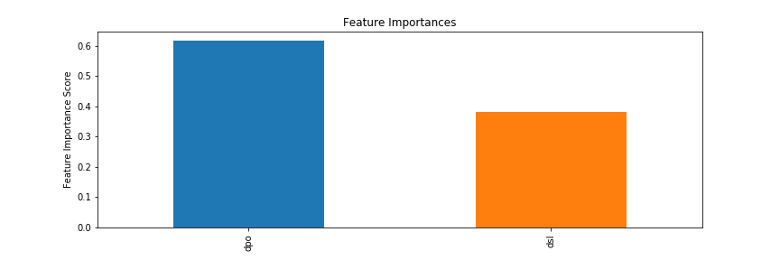
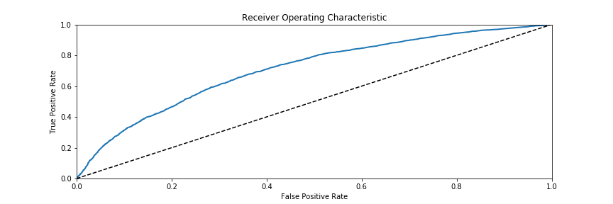
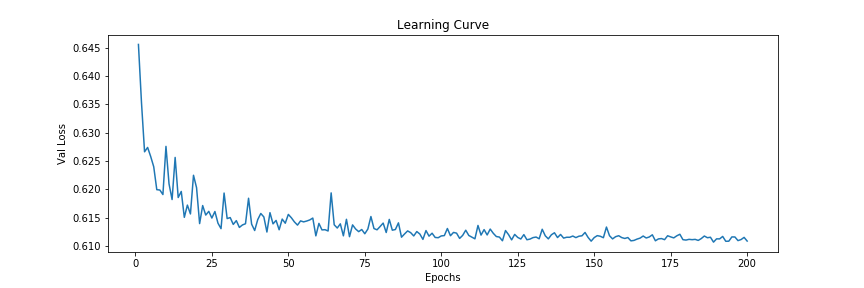
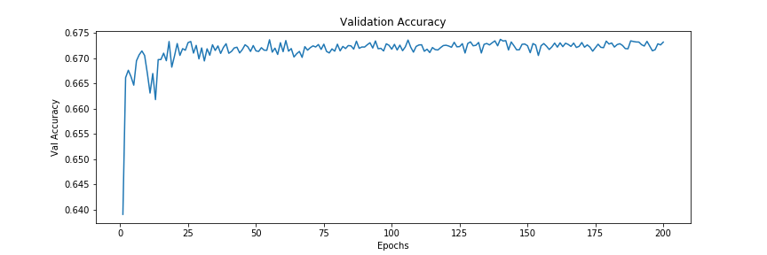

# Customer Purchase Model
A predictive model for customer purchase behavior in e-commerce context.

## Dataset
* This dataset tries to capture customer purchase behavior in baby category.
* This dataset includes 100 mother users from the mother cluster, resulting from K-means clustering based on purchase history.
* The K-means clustering was performed on top 20% users of year 2017.
* For each dataset, datapoint was sampled at uniform time interval (7 days).
* For each sampled reference time, the sample is labelled 1 if user placed an order in baby category within 7 days. Otherwise it's labelled 0.

## Features
* Exponential moving averages of aggregate spending (ema)
* Average days between orders (dpo)
* Average days per quantity purchased (dpq)
* Days since last purchase in all categories (dsl)
* Average browse between consecutive purchases in all categories (bpo, bpo_e)
* Average browse per quantity purchased (bpq)
* Browse since most recent purchase (bsl)
* Average GMV per day between consecutive purchases (gpo, gpo_e)
* GMV / order (gpo)
* GMV / quantity (gpq)
* GMV / day = (GMV / order) / (day / order) (gpd)
* GMV per day since most recent purchase in category (gsl)
: 

# Model
- Multi-Layered Neural Net Binary Classifer
- See def Build_Model() for details
- Only 2 features are included: days per order (gpo), days since last order (dsl)

# Performance
: 
* baseline = 0.59217
* True positive(tp) = 77
* True negative(tn) = 213
* False positive(fp) = 44
* False negative(fn) = 100
* precision = 0.63636
* recall = 0.43503
* accuracy = 0.66820
* True Positive Rate(TPR) = 0.43503
* False Positive Rate(FPR) = 0.17121

: 

: 
